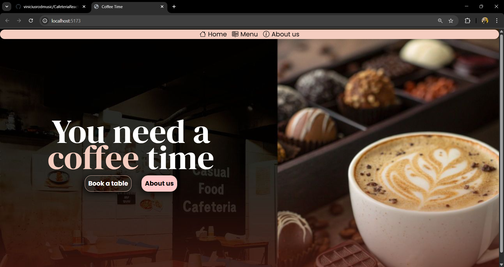

## Cafeteria — React + Vite

Aplicação web de uma cafeteria feita com React e Vite, estilizada com Tailwind CSS. O objetivo é apresentar a página inicial da cafeteria com chamada principal, cabeçalho e seções visuais. O projeto visa a realização de uma boa UI/UX, apresentando uma interface amigável e agradável.

### Status do projeto
- Estado: Em desenvolvimento
- Responsividade: Ainda NÃO otimizado para mobile
- Escopo atual: Página inicial (header, hero, botões e imagens)

### Captura (print-home)

### Tecnologias
- React 19
- Vite 7
- Tailwind CSS 4

### Scripts
No `package.json`:
- `npm run dev`: inicia o servidor de desenvolvimento (Vite)
- `npm run build`: gera a build de produção
- `npm run preview`: faz o preview da build

### Como rodar localmente
1. Instale as dependências:
   - `npm install`
2. Rode o ambiente de desenvolvimento:
   - `npm run dev`
3. Acesse no navegador o endereço mostrado no terminal (geralmente `http://localhost:5173`).

### Estrutura do projeto (resumo)
- `index.html`: HTML base do Vite
- `src/main.jsx`: ponto de entrada React
- `src/App.jsx`: componente raiz
- `src/index.css`: estilos globais (Tailwind importado aqui)
- `src/components/`: componentes reutilizáveis
  - `layout/Header.jsx`: cabeçalho
  - `layout/Main.jsx`: seção principal
  - `MainTitle.jsx`, `Button.jsx`: elementos da hero section
- `src/assets/`: imagens

### Funcionalidades atuais
- Header com identidade visual da cafeteria
- Seção principal (hero) com título e botão de ação
- Imagens ilustrativas de cafés e fundo temático

---

Qualquer feedback ou sugestão é bem-vindo!
